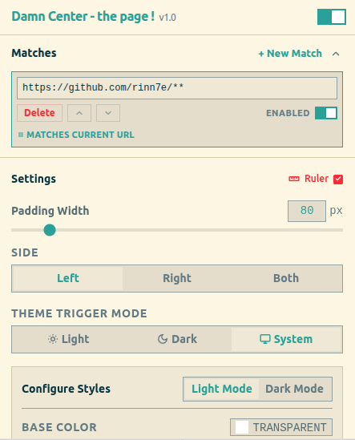

# Damn Center - the page !

A layout-centering browser extension designed to prevent neck and eye strain by bringing web content into a balanced, comfortable view. Ideal for widescreen and ultrawide monitors, it shifts off-centered web layouts to the absolute center, making reading long articles, code, and documentation a comfortable experience.

Damn Center adds customizable left and right padding to web pages on the fly. Adjust padding widths, overlay vertical alignment rulers, select side shifting, customize base colors, and choose beautiful SVG background patterns that automatically synchronize with your system's light/dark mode preference.

Built with **React**, **Vite**, **TypeScript**, **Tailwind CSS**, **react-tea-cup**, and **fp-ts**.

## Screenshot



## Getting Started

### 1. Install Dependencies

Install dependencies using `pnpm`:

```bash
pnpm install
```

### 2. Set Up Environment Variables

Copy the example environment file to configure your local environment settings:

```bash
cp .env.example .env.development
# and/or
cp .env.example .env.production
```

### 3. Development

Run the development server:

```bash
pnpm run dev
```

### 4. Build

Compile production bundles for Chrome, Firefox, and Safari:

```bash
pnpm run build
```

The build scripts output compiled extension bundles to `./dist/chrome`, `./dist/firefox`, and `./dist/safari` containing browser-specific manifests and assets.

### 5. Development Build

Compile development bundles for Chrome, Firefox, and Safari (which load `.env.development` variables and preserve source maps, without zipping):

```bash
pnpm run build:dev
```

---

## Installation

### Web Stores (Recommended)

- **Chrome Web Store**: [https://chromewebstore.google.com/detail/damn-center/jljnmcioeicnlafnjmgknjgegnaccaii](https://chromewebstore.google.com/detail/damn-center/jljnmcioeicnlafnjmgknjgegnaccaii)
- **Firefox Add-ons**: [https://addons.mozilla.org/en-US/firefox/addon/damn-center/](https://addons.mozilla.org/en-US/firefox/addon/damn-center/)
- **Mac App Store (Safari)**: Coming soon!

---

### Manual Build & Installation

If you prefer to compile and install the extension yourself, follow these steps:

#### 1. Build from Source

Ensure you have [Node.js](https://nodejs.org/) and [pnpm](https://pnpm.io/) installed.

```bash
# Install dependencies
pnpm install

# Build the production bundles for all browsers
pnpm run build
```

This compiles the extension code and outputs target directories:

- `./dist/chrome` for Chrome and Chromium-based browsers.
- `./dist/firefox` for Firefox.
- `./dist/safari` for Safari.

#### 2. Load the Extension into Your Browser

##### For Chrome and Chromium-based Browsers (Brave, Edge, Vivaldi, Opera)

1. Open the browser and navigate to `chrome://extensions/`.
2. Enable **Developer mode** using the toggle in the top-right corner.
3. Click the **Load unpacked** button in the top-left corner.
4. Select the `./dist/chrome` directory from this repository.

##### For Firefox

1. Open the browser and navigate to `about:debugging#/runtime/this-firefox`.
2. Click the **Load Temporary Add-on...** button.
3. Select the `manifest.json` file inside the `./dist/firefox` directory.

##### For Safari

1. Open the browser and open **Settings** (or **Preferences**).
2. Go to the **Advanced** tab and ensure **"Show features for web developers"** (or **"Show Develop menu in menu bar"**) is checked.
3. In the new **Develop** menu in your system menu bar, check **"Allow Unsigned Extensions"**.
4. Go to **Safari Settings > Developer** (or under **Develop** in the menu bar) and click **"Add Temporary Extension..."**.
5. Select the `./dist/safari` directory from this repository.

---

## Environment Variables

The project loads configurations from environment files based on the build target mode (`.env.development` or `.env.production`). These files are ignored by git to protect local preferences.

To set up your environment variables:

1. Copy the example environment file:
   ```bash
   cp .env.example .env.development
   # and/or
   cp .env.example .env.production
   ```
2. Configure the variables as desired inside the newly created files:

| Variable Name            | Description                                                                                                   | Default / Example Value      |
| :----------------------- | :------------------------------------------------------------------------------------------------------------ | :--------------------------- |
| `VITE_UI_THEME_ID`       | Theme identifier for the extension's popup UI.                                                                | `solarizedLight`             |
| `VITE_DISABLE_LOG`       | Strips all `console.*` (log, warn, error, info, debug) calls from compiled bundles if set to `true`.          | `true` (prod), `false` (dev) |
| `VITE_SHOW_BUILD_DATE`   | Displays the formatted date/time of the build under the extension title in the popup header if set to `true`. | `true`, `false`              |
| `VITE_DEFAULT_FONT_SIZE` | Defines the default root font size in pixels (e.g. 16) for scaling the extension's popup UI.                  | `16`                         |

---

## Features

- **Width Adjustment**: Scale padding width dynamically using the popup slider.
- **Side Selection**: Apply padding to the left side, right side, or both sides.
- **Alignment Ruler**: Toggle a vertical centered ruler guide to assist with layout alignment.
- **Layout Shifting & Strategies**: Restructures layout using CSS Flexbox shifting (preserves absolute/sticky layouts) or Classic shifting strategies to prevent padding from overlapping content.
- **Theme Compatibility**: Supports independent configurations for Light and Dark modes. Can sync with system preferences (`prefers-color-scheme`) or force a specific mode.
- **SVG Patterns**: Apply customizable SVG background patterns (grids, dots, stripes, carbon, or lattice) over background colors.
- **Disable when Not Maximized**: Automatically suspends padding and alignment rules when the window is tiled, restored, or not fully maximized. Bypasses OS-level and fractional browser zoom discrepancies (such as Chrome on Linux Wayland bugs) to keep window space fully optimized.
- **Auto-Disable on Fullscreen**: Automatically suspends padding and alignment rules when a website enters fullscreen mode (resolves Youtube and other fullscreen video viewport conflicts).
- **Popup UI Font Size Controller**: Adjust the root font size of the extension's popup UI (clamped between `12px` and `32px` in `1px` steps, default `16px`) for clean text scaling.
- **Collapsible Matches**: Collapse list items in the popup UI to organize configuration matches.
- **Dynamic Version Header**: Displays manifest version and build date inside the popup UI.

For a detailed list of changes across releases, see the [CHANGELOG.md](CHANGELOG.md).

---

## Layout Shifting Mechanism

To shift page content dynamically without breaking absolute or sticky elements, the extension restructures the document layout at the root using CSS Flexbox:

```
+-------------------------------------------------------------+
| html (display: flex; flex-direction: row; overflow: hidden) |
|                                                             |
| +------------+ +------------------------------+ +---------+ |
| | Left Pad   | | Body                         | |Right Pad| |
| | (order: 1) | | (order: 2; overflow-y: auto) | |(order:3)| |
| |            | |                              | |         | |
| | [Pattern]  | | [ Page Content ]             | | [Color] | |
| |            | |                              | |         | |
| +------------+ +------------------------------+ +---------+ |
+-------------------------------------------------------------+
```

1. **Root Flexbox Container**: The `html` element is transformed into a horizontal flex container.
2. **Constrained Scrollable Body**: Viewport scrolling is disabled on `html`, and shifted to `body` (`overflow-y: auto`). The body's width is constrained to make room for padding.
3. **Flex Order Positioning**: Left and right pads are inserted as flex items with explicitly defined orders, shifting the body content to the center dynamically.

---

## Known Incompatibilities

The following websites are currently known to be incompatible with the extension's layout shifting mechanism:

- [https://studio.youtube.com/](https://studio.youtube.com/) (YouTube Studio)
- [https://mail.google.com/mail/](https://mail.google.com/mail/) (Gmail)

---

## Video Showcase

[](https://www.youtube.com/watch?v=Yc29sO4jF9g)

---

## License

This project is licensed under the GNU General Public License v3.0. See the [LICENSE](LICENSE) file for details.
