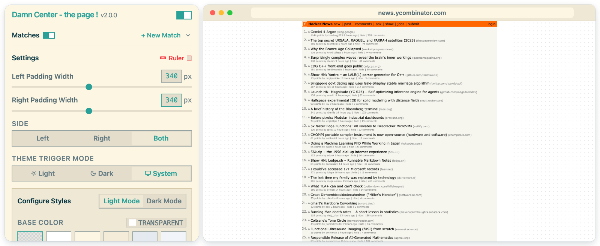

<p align="center">
  
</p>

<h1 align="center">Damn Center - the page!</h1>

<p align="center">
  Center any website on your widescreen or ultrawide monitor, for Chrome, Firefox and Safari.
</p>

<p align="center">
  <a href="https://github.com/rinn7e/damn-center-extension/actions/workflows/ci.yml"></a>
  <a href="https://chromewebstore.google.com/detail/damn-center/jljnmcioeicnlafnjmgknjgegnaccaii"></a>
  <a href="https://chromewebstore.google.com/detail/damn-center/jljnmcioeicnlafnjmgknjgegnaccaii"></a>
  <a href="https://chromewebstore.google.com/detail/damn-center/jljnmcioeicnlafnjmgknjgegnaccaii"></a>
  <a href="https://addons.mozilla.org/en-US/firefox/addon/damn-center/"></a>
  <a href="https://addons.mozilla.org/en-US/firefox/addon/damn-center/"></a>
  <a href="LICENSE"></a>
  <a href="AI-DECLARATION.md"></a>
</p>

A layout-centering browser extension designed to prevent neck and eye strain by bringing web content into a balanced, comfortable view. Ideal for widescreen and ultrawide monitors, it shifts off-centered web layouts to the absolute center, making reading long articles, code, and documentation a comfortable experience.

Damn Center adds customizable left and right padding to web pages on the fly. Adjust padding widths, overlay vertical alignment rulers, select side shifting, customize base colors, and choose beautiful SVG background patterns that automatically synchronize with your system's light/dark mode preference.

## Install

- **Chrome, Edge, Brave and other Chromium browsers**: [Chrome Web Store](https://chromewebstore.google.com/detail/damn-center/jljnmcioeicnlafnjmgknjgegnaccaii)
- **Firefox**: [Firefox Add-ons](https://addons.mozilla.org/en-US/firefox/addon/damn-center/)
- **Safari**: coming soon to the Mac App Store. Until then, [build it from source](#build-from-source).

## Screenshot



## Video Showcase

[](https://www.youtube.com/watch?v=GnFG-Eb1EGc)

## Features

- **Per-Site Matches**: Save different settings per site or path with URL patterns. **+ New Match** adds a rule for the current page in one click, and a domain toggle switches all of a site's matches on or off.
- **Import & Export**: Back up and restore all your matches and settings.
- **Width Adjustment**: Scale padding width dynamically using the popup slider.
- **Side Selection**: Apply padding to the left side, right side, or both sides.
- **Alignment Ruler**: Toggle a vertical centered ruler guide to assist with layout alignment.
- **Layout Shifting & Strategies**: Restructures layout using CSS Flexbox shifting (preserves absolute/sticky layouts) or Classic shifting strategies to prevent padding from overlapping content.
- **Theme Compatibility**: Supports independent configurations for Light and Dark modes. Can sync with system preferences (`prefers-color-scheme`) or force a specific mode.
- **SVG Patterns**: Apply customizable SVG background patterns (grids, dots, stripes, carbon, or lattice) over background colors.
- **Disable when Not Maximized**: Automatically suspends padding and alignment rules when the window is tiled, restored, or not fully maximized. Bypasses OS-level and fractional browser zoom discrepancies (such as Chrome on Linux Wayland bugs) to keep window space fully optimized.
- **Auto-Disable on Fullscreen**: Automatically suspends padding and alignment rules when a website enters fullscreen mode (resolves Youtube and other fullscreen video viewport conflicts).
- **Popup UI Font Size Controller**: Adjust the root font size of the extension's popup UI (`12px` to `32px` in `1px` steps, default `18px`) for clean text scaling.
- **Collapsible Matches**: Collapse list items in the popup UI to organize configuration matches.
- **Version Header**: Shows the extension version in the popup header (development builds also show the build date).

See the [CHANGELOG](CHANGELOG.md) for changes in each release.

## Known Incompatibilities

The following websites are currently known to be incompatible with the extension's layout shifting mechanism:

- [YouTube Studio](https://studio.youtube.com/)
- [Gmail](https://mail.google.com/mail/)

Found another one? [Open an issue](https://github.com/rinn7e/damn-center-extension/issues/new/choose).

---

## Development

Built with **React**, **Vite**, **TypeScript**, **Tailwind CSS**, **react-tea-cup**, and **fp-ts**. See [CONTRIBUTING.md](CONTRIBUTING.md) for the checks to run before opening a pull request.

### Build from Source

You need [Node.js](https://nodejs.org/) 24+ and [pnpm](https://pnpm.io/).

```bash
pnpm install
cp .env.example .env.development
cp .env.example .env.production
```

| Command                  | Output                                                                                                                                                            |
| :----------------------- | :---------------------------------------------------------------------------------------------------------------------------------------------------------------- |
| `pnpm run dev`           | Vite dev server for the popup UI.                                                                                                                                 |
| `pnpm run build`         | Development builds (`.env.development`, DEV icons, build date in the popup) for all browsers in `./dist/chrome`, `./dist/firefox` and `./dist/safari`, plus zips. |
| `pnpm run build:chrome`  | The development build for one browser (also `build:firefox`, `build:safari`).                                                                                     |
| `pnpm run build:release` | Release builds (`.env.production`) for all browsers, the same as the store versions, plus zips in `./dist/`.                                                      |

### Load the Extension into Your Browser

#### Chrome and Chromium-based browsers (Brave, Edge, Vivaldi, Opera)

1. Open the browser and navigate to `chrome://extensions/`.
2. Enable **Developer mode** using the toggle in the top-right corner.
3. Click the **Load unpacked** button in the top-left corner.
4. Select the `./dist/chrome` directory from this repository.

#### Firefox

1. Open the browser and navigate to `about:debugging#/runtime/this-firefox`.
2. Click the **Load Temporary Add-on...** button.
3. Select the `manifest.json` file inside the `./dist/firefox` directory.

#### Safari

1. Open the browser and open **Settings** (or **Preferences**).
2. Go to the **Advanced** tab and ensure **"Show features for web developers"** (or **"Show Develop menu in menu bar"**) is checked.
3. In the new **Develop** menu in your system menu bar, check **"Allow Unsigned Extensions"**.
4. Go to **Safari Settings > Developer** (or under **Develop** in the menu bar) and click **"Add Temporary Extension..."**.
5. Select the `./dist/safari` directory from this repository.

A temporary extension is removed when Safari quits. To keep it installed, build the Safari app wrapper instead (macOS with Xcode installed):

```bash
pnpm run generate:safari
```

This runs `build:safari:release` and converts `dist/safari` into an Xcode project in `./safari-extension/` (git-ignored). Open `safari-extension/Damn Center/Damn Center.xcodeproj`, run the **Damn Center** app once, then turn the extension on in **Safari Settings > Extensions**. Unsigned local builds still need **Allow Unsigned Extensions** enabled.

### Environment Variables

Builds load `.env.development` or `.env.production` depending on the mode. Both are ignored by git. `.env.example` holds the release values; set `VITE_DISABLE_LOG=false` in `.env.development` if you want console logs. Development builds always show the build date and use the DEV icons, so they're easy to tell apart from store builds.

| Variable                 | Description                                                                                                                 | `.env.example`   |
| :----------------------- | :-------------------------------------------------------------------------------------------------------------------------- | :--------------- |
| `VITE_UI_THEME_ID`       | Theme for the popup UI.                                                                                                     | `solarizedLight` |
| `VITE_DISABLE_LOG`       | Strips all `console.*` calls from the bundles when `true`.                                                                  | `true`           |
| `VITE_SHOW_BUILD_DATE`   | Shows the build date under the title in the popup header in release builds when `true` (development builds always show it). | `false`          |
| `VITE_DEFAULT_FONT_SIZE` | Default popup font size in pixels, until the user changes it (16 if unset).                                                 | `18`             |

### Layout Shifting Mechanism

To shift page content dynamically without breaking absolute or sticky elements, the extension restructures the document layout at the root using CSS Flexbox:

```
+-------------------------------------------------------------+
| html (display: flex; flex-direction: row; overflow: hidden) |
|                                                             |
| +------------+ +------------------------------+ +---------+ |
| | Left Pad   | | Body                         | |Right Pad| |
| | (order: 1) | | (order: 2; overflow-y: auto) | |(order:3)| |
| |            | |                              | |         | |
| | [Pattern]  | | [ Page Content ]             | | [Color] | |
| |            | |                              | |         | |
| +------------+ +------------------------------+ +---------+ |
+-------------------------------------------------------------+
```

1. **Root Flexbox Container**: The `html` element is transformed into a horizontal flex container.
2. **Constrained Scrollable Body**: Viewport scrolling is disabled on `html`, and shifted to `body` (`overflow-y: auto`). The body's width is constrained to make room for padding.
3. **Flex Order Positioning**: Left and right pads are inserted as flex items with explicitly defined orders, shifting the body content to the center dynamically.

### Project Docs

- [Code Convention](doc/code-convention.md): design principles and style rules.
- [Security](doc/security.md): the zero-network, local-storage design and permissions.
- [Release Guide](doc/release.md): versioning, building and publishing.
- [Design Assets](doc/assets.md): where the icons, screenshots and store graphics come from.

---

## AI Declaration

This project declares its AI usage in [AI-DECLARATION.md](AI-DECLARATION.md), following the [AI-DECLARATION.md](https://ai-declaration.md) standard (level: `assist`).

## License

This project is licensed under the GNU General Public License v3.0. See the [LICENSE](LICENSE) file for details.
